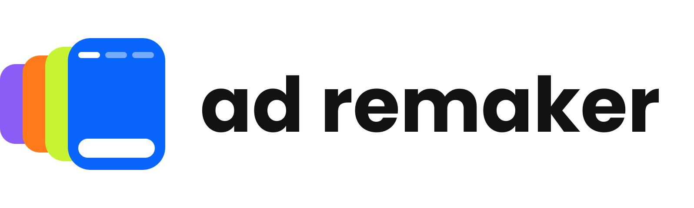

<p align="center">
  <picture>
    <source media="(prefers-color-scheme: dark)" srcset="docs/brand/logo-lockup-horizontal-dark.svg">
    
  </picture>
</p>

# Ad Remaker

Ad Remaker is an independent agent that finds competitor ads with public performance signals, deconstructs their creative mechanics, and adapts them to your brand's real product. It never copies an ad exactly, never invents claims, and never spends money or publishes anything without your explicit approval. The same files install as a Hermes profile, a Claude Code plugin, or a Codex plugin for CLI and Desktop.

Inspired by the Recreate competitor ads agent from [Rerun](https://rerun.build/templates/recreate-competitor-ads-meta?via=aRLmG4). If you want the same agent without installing or configuring anything, use Rerun directly.

This is an independent, unofficial adaptation. According to the maintainer, the marketing team (Théo) authorized an open-source release on October 8, 2026, provided attribution is included. These are affiliate links: the maintainer may earn a commission.

## How it works

The main workflow runs these stages in order. Steps marked **you approve** stop until you give an explicit yes.

**Setup, once.** On your first relevant ad task, the agent offers a short setup before any research, so you can keep the free path or use services you already use, for every stage (research, video creation, delivery) or stage by stage. The wording and the suggested default vary by runtime and model. Answering **Free for everything** completes setup with no login, even when that phrase is not one of the options shown. Your choices are saved outside Git and plugin caches and reused next time, each product keeps its own confirmed brief, and choosing a provider never approves any spending. Then the agent continues your original request.

1. **Find** competitor ads with public performance signals, through a connected ad-intelligence tool or the free public ad libraries. Run length, variants, and visible engagement are signals, never proof of profitability; every statement is labeled fact, estimate, opinion, or unknown.
2. **Deconstruct** the creative mechanics: hook, shot sequence, framing, pacing, on-screen text, voice, and music, with a cut list, frame sheets, and a transcript when the local tools are available. Anything the evidence does not establish is marked unknown.
3. **Adapt** the mechanics to your real product: no exact copy, every competitor trace replaced (brand, logo, product, person, voice, music, captions, metadata), and only claims your brand files or sources support.
4. **Cost estimate, you approve.** Before any paid generation the agent shows units, unit price, subtotal, a 20% retry margin, total, currency, and whether each price is verified or estimated. A paid batch starts only after you approve that exact batch.
5. **Generate** with a generation tool you have connected. Without one, the agent stops at a remake pack and never claims a render.
6. **Strict QC.** The remake is compared with the source shot by shot. It needs at least 8/10 for structural faithfulness, at least 7/10 for production quality, and zero competitor traces.
7. **Deliver** every file, linked, with explicit choices such as approve, choose person A or B, request changes, or stop.
8. **Optional Meta campaign draft, you approve.** After final approval, and only with an authenticated Meta tool, the agent creates the campaign paused and reads it back. Publication, activation, scheduling, and spend each need their own separate approval. Without a Meta tool you get a manual launch pack instead.

**With no paid provider connected**, the agent follows its `free-fallback-mode` Skill: research in public ad libraries (Meta Ad Library, TikTok Creative Center, Google Ads Transparency Center, and others), local analysis scripts, and a seven-file remake pack (storyboard, script, paste-ready prompts, two casting options, editing and music brief, QC checklist, manual Meta launch pack). It says plainly what it cannot do on that path: no access to private spend, revenue, conversion, or ROAS data, no rendered images, video, voice, or music, and no Meta object created. Web research also needs a working browser or search tool in your runtime; when none works, the agent asks you for library links, files, or screenshots.

The rules come from [`SOUL.md`](SOUL.md) and the Skills in [`skills/`](skills/). [`docs/architecture.md`](docs/architecture.md) explains how the layers fit together.

## Which version should you choose?

Rerun is the simple option if you want to get started without a terminal. The plugin and profile let you use your existing environment.

| Criterion | [Rerun](https://rerun.build?via=aRLmG4) | Claude Code plugin | Codex CLI and Desktop plugin | Hermes profile |
|---|---|---|---|---|
| Intended users | Non-technical users who want a ready-to-use agent | People who already use Claude Code | People who already use Codex CLI or Desktop | People who run Hermes |
| Setup time | A few seconds to add the agent; about 5 min for configuration, according to the template page | A few minutes if Claude Code is already configured, plus connections to the services you use (estimate) | A few minutes if Codex CLI is already configured; vendors are optional (estimate) | A few minutes if Hermes is already configured, plus model selection and connections to the services you use (estimate) |
| Hosting | Hosted and managed by the service | On the machine where you run Claude Code | On the machine where you run Codex | On the machine or server where you run Hermes |
| Cost | Free trial to get started, then a paid subscription; model and service costs depend on usage | Free plugin (MIT); Claude Code access, models, and external services depend on your plans | Free plugin (MIT); Codex model access and external services depend on your plans | Free profile (MIT); models, optional hosting, and external services depend on your plans |
| External tools needed | Higgsfield or Kie AI (or another generator) for generation; TrendTrack is optional for research; Meta Ads is optional for drafts | TrendTrack is optional; Higgsfield or Kie AI (or another connected generator) for generation; Meta Ads is optional; local analysis mode works without a generator | None for the text remake pack; local scripts need their declared dependencies; optional vendors are separately configured | TrendTrack is optional; Higgsfield or Kie AI (or another connected generator) for generation; Meta Ads is optional; local analysis mode works without a generator |

Information checked on October 8, 2026: [template](https://rerun.build/templates/recreate-competitor-ads-meta?via=aRLmG4) and [service plans](https://rerun.build/pricing?via=aRLmG4). The free trial requires a payment card. Adding the template does not connect your external accounts. Research can use public ad libraries when TrendTrack is unavailable; delivery provides files for manual import when Meta Ads is unavailable. Plans and requirements may change.

## Install

Details for each runtime: [Claude Code setup](docs/claude-code-setup.md), [Codex setup](docs/codex-setup.md), and [architecture](docs/architecture.md) for Hermes MCP servers.

### Claude Code

```bash
claude plugin marketplace add Pivii/ad-remaker
claude plugin install ad-remaker@ad-remaker
```

The plugin adds the `ad-remaker` subagent, six Skills, and five vendor MCP servers that stay unauthenticated until you sign in. Sign in only to the vendors you pay for, and block the others; see [Claude Code setup](docs/claude-code-setup.md), which also covers the optional local FFmpeg tool and vendor Skills.

### Codex CLI and Desktop

```bash
codex plugin marketplace add Pivii/ad-remaker --ref main
codex plugin add ad-remaker@ad-remaker
```

The plugin adds six Skills and no MCP servers. Verified with Codex CLI `0.160.0` and, headlessly, with the runtime bundled in Codex Desktop `26.930.61225` (runtime `0.160.1`); the Desktop Plugins Directory and Skill selection in its interface are not verified yet. For a local clone, export a clean package first. See [Codex setup](docs/codex-setup.md) for the local export, update, uninstall, and optional vendors.

### Hermes

```bash
hermes profile install /path/to/ad-remaker --yes
hermes -p ad-remaker model
```

The second command picks the model for the profile. Vendor MCP servers ship disabled in `config.yaml`; [architecture](docs/architecture.md) explains how to enable the ones you pay for. Vendor Skills are optional: `scripts/install_provider_skills.sh pika`.

## Usage

### Start the agent

| Runtime | Start | Then |
|---|---|---|
| Claude Code | `claude --agent ad-remaker:ad-remaker` | Type a prompt below. In a session that is already open, start the prompt with `@agent-ad-remaker:ad-remaker`, or call the workflow directly with `/ad-remaker:winning-ad-remake-workflow`. |
| Codex | `codex`, from your own project folder | Start each prompt with `$ad-remaker:winning-ad-remake-workflow`, or `$ad-remaker:meta-ads-usage` for the Meta prompt. Type `$` to select a Skill in the client. |
| Hermes | `hermes -p ad-remaker` | Type a prompt below. For a single answer without a session, run `hermes -p ad-remaker chat -q "<prompt>"`. |

Run the agent from your own project folder, not from this repository: product briefs are saved per project folder. A one-shot run cannot answer the agent's setup or approval questions, so use a session for your first run and for anything beyond research and analysis.

### First run and setup

Your first ad request starts a short setup; you do not need a paid service. To start it yourself, or to change your tools, your product brief, or both later:

| Runtime | Setup entrypoint |
|---|---|
| Claude Code | `/ad-remaker:setup` |
| Codex | `$ad-remaker:setup` |
| Hermes | `Use your setup Skill to configure Ad Remaker.` |

Free means public ad research and a script, storyboard, and prompts, with no new video rendered from prompts. Automatic setup depends on the client and model; if it does not appear, use the entrypoint above. [The setup guide](docs/setup.md) covers the routes, connecting a service you already use, where choices are saved, and recovery.

### Example prompts

Replace the text in angle brackets. Each example says what the agent asks before it spends or publishes anything: those questions are expected behavior, not errors.

**1. Free first run, no provider connected**

```text
Find winning ads for <category> in the public ad libraries and give me a deconstruction of the best one.
```

On a first run, the agent offers setup before searching; the choices it shows vary by runtime. Answering **Free for everything** saves the free path without any login, and it then continues this request. The agent reports which stages run on the free path and which tools are missing. If no browser or search tool works in your runtime, it asks you for library links or screenshots instead of inventing results. Nothing here costs money, so there is no approval step; spend, revenue, and ROAS stay marked unknown.

**2. Full remake for your brand**

```text
Here is my product page <url>. Find 3 competitor ads with real performance signals and propose a remake adapted to my product. Estimate costs before generating anything.
```

You get a labeled shortlist and a remake design. Before any paid generation, the agent shows the batch with units, prices, retry margin, total, and currency, and waits for you to approve that exact batch. With no generation tool connected, it delivers the remake pack and says that nothing was rendered.

**3. Analyze an ad you already have**

```text
Deconstruct this ad (<file or link>): hook, structure, offer, visual mechanics, and what I can reuse without copying.
```

The agent asks before downloading a public video or installing a missing local tool such as `ffmpeg` or `scenedetect`. What it cannot measure, such as spoken words without a transcriber, is marked unknown.

**4. Give the agent your brand facts**

Keep your product facts in a folder you control, for example `local/brands/<brand>/` with `brand.md`, `products.md`, and `claims.md`. In Hermes, put it inside the installed profile folder (`hermes profile show ad-remaker` prints its path); `local/` is ignored by Git there. In Claude Code and Codex, put it in your own project folder, never inside the plugin cache. Then tell the agent where it is, with the full path if you started the agent from another folder:

```text
Use only the brand facts in <brand folder> (brand.md, products.md, claims.md). Do not use any claim that is not supported there, and tell me what is missing before you propose a remake.
```

The agent does not read this folder on its own; name it in your request. Setup can also save a confirmed brief for each product (see [the setup guide](docs/setup.md)); facts the agent infers from your documents stay unconfirmed until you approve them. Claims, testimonials, and results that your files do not support are left out, not softened.

**5. Paused Meta campaign draft**

```text
Prepare a paused Meta campaign draft for the approved creative.
```

The agent reads its Meta rules first. With an authenticated Meta tool, it confirms the ad account, Page, objects, names, and budget with you before creating anything, creates every object paused, and reads each one back. Without a Meta tool, it gives you a manual launch pack for Ads Manager. Activation, scheduling, and any spend each need a separate, explicit approval.

## Established principles

- Analyze creative mechanics without copying an ad exactly.
- Separate observable facts, estimates, opinions, and unknowns.
- Do not generate paid content without a cost estimate and explicit approval.
- Do not publish, activate, schedule, or spend any budget without separate human approval.
- Remove every identifiable competitor trace from the final deliverable.
- Verify deliverables before reporting success.

## Contributing

Contributions are welcome: new free research sources, provider integrations, Skill improvements, docs, and bug reports from real runs. Read [CONTRIBUTING.md](CONTRIBUTING.md) for the setup, the checks to run before a pull request, and the repository rules.

## License

[MIT](LICENSE), copyright 2026 Pivi Solutions. External vendor source material retained for provenance and separately installed vendor Skills remain subject to their own terms; this license does not relicense them.
